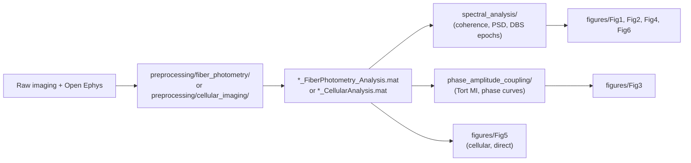

# Tracking multi-site somatic voltage dynamics via high-speed fiber photometry

Analysis code accompanying the manuscript *"Tracking multi-site somatic voltage dynamics via
high-speed fiber photometry"* (Chakraborty, van Veghel, et al., bioRxiv 2026). This repo covers
the full pipeline from raw GEVI fiber-photometry / cellular voltage imaging + LFP recordings
to every main-text and supplementary figure.

## Quick start

1. Read [`environment/SETUP.md`](environment/SETUP.md) — install MATLAB toolboxes, the Python
   environment, and (most importantly) **set your own data root** in `config/` before running
   anything.
2. Find your figure of interest in the table below and open its folder's `README.md`.
3. Preprocessing (MATLAB) must run before spectral analysis, PAC, or any figure script — see
   [`preprocessing/`](preprocessing/) below.

## Repository layout

```
├── config/                       # Centralised paths (MATLAB + Python) -- edit this first
├── environment/                  # SETUP.md, requirements.txt, environment.yml
├── docs/                         # Workflow schematics (diagrams + walkthrough)
├── preprocessing/
│   ├── fiber_photometry/         # Raw imaging + Open Ephys -> *_FiberPhotometry_Analysis.mat
│   └── cellular_imaging/         # Single-neuron voltage imaging -> *_CellularAnalysis.mat
├── spectral_analysis/            # LFP-GEVI coherence, PSD, REST/RUN, DBS-epoch spectral analysis
├── phase_amplitude_coupling/     # Theta-gamma PAC: phase-aligned spectrograms, Tort MI + surrogates
└── figures/
    ├── common/                   # Shared plotting helpers + cohort config
    ├── Fig1_platform_validation/
    ├── Fig2_locomotion_spectral/
    ├── Fig3_theta_gamma_pac/
    ├── Fig4_population_dbs/
    ├── Fig5_singlecell_dbs/
    ├── Fig6_bilateral_ca1/
    └── Supplementary/
```

## Figure → code map

| Figure | What it shows | Compute (MATLAB) | Plot (Python) |
|--------|----------------|-------------------|----------------|
| **Fig 1** | Platform overview; GEVI-LFP raw traces + theta cross-correlation | [`preprocessing/fiber_photometry/`](preprocessing/fiber_photometry/) | [`figures/Fig1_platform_validation/`](figures/Fig1_platform_validation/) |
| **Fig 2** | Locomotion-dependent LFP/GEVI spectral power & coherence | [`spectral_analysis/`](spectral_analysis/) | [`figures/Fig2_locomotion_spectral/`](figures/Fig2_locomotion_spectral/) |
| **Fig 3** | Theta-gamma phase-amplitude coupling (Tort MI) | [`phase_amplitude_coupling/`](phase_amplitude_coupling/) | [`figures/Fig3_theta_gamma_pac/`](figures/Fig3_theta_gamma_pac/) |
| **Fig 4** | Population (fiber) DBS response, 40 vs 135 Hz | [`spectral_analysis/`](spectral_analysis/) (`run_stim_spectral_pipeline.m`) | [`figures/Fig4_population_dbs/`](figures/Fig4_population_dbs/) |
| **Fig 5** | Single-cell (cellular) DBS response | [`preprocessing/cellular_imaging/`](preprocessing/cellular_imaging/) | [`figures/Fig5_singlecell_dbs/`](figures/Fig5_singlecell_dbs/) |
| **Fig 6** | Bilateral CA1 cross-correlation & phase-locking | [`preprocessing/fiber_photometry/`](preprocessing/fiber_photometry/), [`spectral_analysis/`](spectral_analysis/) | [`figures/Fig6_bilateral_ca1/`](figures/Fig6_bilateral_ca1/) |
| **Fig 7 (E-H)** | Dual-color, multi-animal fiber voltage imaging during DBS | — (input: a single pre-extracted `all_traces` `.mat` file) | [`figures/Fig7_dualcolor_multianimal/`](figures/Fig7_dualcolor_multianimal/) |
| Suppl. Fig 1 | Photobleaching control | — | [`figures/Supplementary/`](figures/Supplementary/) |
| Suppl. Fig 2 | Striatal DBS | [`spectral_analysis/`](spectral_analysis/) | `figures/Fig4_population_dbs/stimulation_analysis.py --mode striatum-dbs` |

Figure 7 panels A-D (optical setup schematic, cage photo, FOV image, histology) were assembled
by hand and are not reproduced here.

## Pipeline overview



## Data & code availability

Raw imaging and electrophysiology data are not included (too large for a code repository).
Each pipeline stage's README documents its expected input/output `.mat` schema so you can
substitute your own recordings, following the same acquisition protocol described in the
manuscript's Methods.

## External dependencies

Not bundled with this repo — see [`environment/SETUP.md`](environment/SETUP.md) for the full
list (FieldTrip, optionally NoRMCorre, an Open Ephys MATLAB loader, spike-detection scripts,
and a handful of Python packages).
