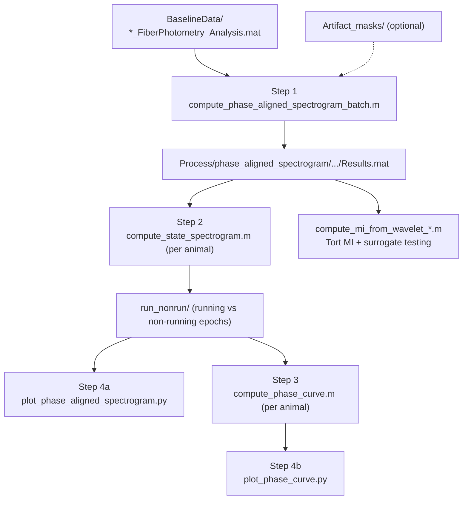

# Phase-Amplitude Coupling (PAC) Pipeline

## Overview

This folder computes theta-phase-aligned wavelet spectrograms, phase-amplitude curves, and
Tort's Modulation Index (MI) with surrogate significance testing, from preprocessed
fiber-photometry + LFP recordings. It produces the theta-gamma coupling analysis behind
**Figure 3** of the manuscript (`../preprocessing/fiber_photometry/` produces the input
`*_FiberPhotometry_Analysis.mat` files this pipeline consumes).

## Important: where this folder must live

Every script here locates the **project root** as its own **parent directory** (MATLAB:
`fileparts(fileparts(mfilename('fullpath')))`; Python: `Path(__file__).resolve().parent.parent`).
So `phase_amplitude_coupling/` must sit at the top level of your working project, alongside:

```
your_project_root/
├── BaselineData/              # Input: *_FiberPhotometry_Analysis.mat (organised by condition/animal/trial)
├── Artifact_masks/            # Optional: *_artifact_removal.mat masks, see below
├── Process/                   # Intermediate + output .mat files (created automatically)
├── Figures/                   # Python figure outputs (created automatically)
└── phase_amplitude_coupling/  # ← this folder
        ├── compute_phase_aligned_spectrogram_batch.m
        ├── ...
        ├── tortlab/eegfilt.m
        └── utils/              # shared MI/histogram/plotting helpers (see below)
```

If you copy this repo elsewhere, keep this relative layout -- copying only this folder without
`BaselineData/`/`Process/` gives you the code for reference but nothing to compute from.

## Contents

| File | Role |
|------|------|
| `compute_phase_aligned_spectrogram_batch.m` | **Step 1**: batch-reads `BaselineData/`, computes LFP theta phase + wavelet spectrograms, aligns epochs to theta phase, writes per-trial `PhaseAlignedSpectrogram_Results_*.mat` |
| `compute_state_spectrogram.m` | **Step 2**: pick **one animal's** folder, split epochs into running/non-running by speed, write summary `.mat` under `run_nonrun/` |
| `compute_phase_curve.m` | **Step 3**: extract theta/gamma phase-amplitude curves from `run_nonrun/`, write `Process/phase_curve/.../PhaseCurve_*.mat` |
| `plot_phase_aligned_spectrogram.py` | **Step 4a**: read the `run_nonrun/` spectrogram `.mat` files, plot to `Figures/phase_aligned_spectrogram/` |
| `plot_phase_curve.py` | **Step 4b**: read `PhaseCurve_*.mat`, plot to `Figures/phase_curve/` |
| `tortlab/eegfilt.m` | EEGLAB-style bandpass filter (phase-extraction dependency); added to the path by the batch script |
| `compute_mi_from_wavelet_iaaft_per_epoch.m` | MI + **IAAFT surrogate, per epoch** (LFP→Fiber and LFP→LFP) |
| `compute_mi_from_wavelet_epoch_shuffle.m` | MI + **epoch-shuffle surrogate** (LFP→Fiber) |
| `compute_mi_from_wavelet_results.m` | MI + **full-sequence IAAFT** (an alternative to the per-epoch strategy; use as needed) |
| `utils/` | MI/histogram/plotting helpers shared by the three `compute_mi_from_wavelet_*.m` scripts above (added to the path by each script) |

Populating `Artifact_masks/` is optional: the batch script (Step 1) will look there for
`<session>_artifact_removal.mat` files (the same format produced by
`../preprocessing/fiber_photometry/artifact_removal_lfp.m`) and mark artifactual epochs; if the
folder is empty or missing, every epoch is simply treated as artifact-free.

## Dependencies

- **MATLAB** R2016b+; **Signal Processing Toolbox** (for `eegfilt` and friends).
- **Parallel Computing Toolbox** (optional): `compute_mi_from_wavelet_iaaft_per_epoch.m` uses
  `parfor` for speed; without the toolbox, change `parfor` to `for`.
- **Python 3.8+**: `numpy`, `matplotlib`, `scipy`.

## Pipeline flow



## Step-by-step

1. **(Optional)** Populate `Artifact_masks/` with your own `*_artifact_removal.mat` files.

2. **MATLAB**: run `compute_phase_aligned_spectrogram_batch.m`.
   - Output: `Process/phase_aligned_spectrogram/<condition>/<animal>/<trial>/PhaseAlignedSpectrogram_Results_*.mat`.

3. **MATLAB**: run `compute_state_spectrogram.m`.
   - A folder-picker dialog appears -- select **one animal's** folder (the level containing its
     per-trial subfolders).
   - Run once per animal.
   - Output: `.../run_nonrun/LFP|Fiber1|Fiber2/running|non_running|all_epochs/...`.

4. **(Optional)** Plot phase-aligned spectrograms:
   - `python plot_phase_aligned_spectrogram.py`
   - Output: `Figures/phase_aligned_spectrogram/...`.

5. **Phase curve data + figure**:
   - **MATLAB**: `compute_phase_curve.m` (again, pick one animal's folder).
   - **Python**: `plot_phase_curve.py`
   - Output: `Process/phase_curve/...` and `Figures/phase_curve/...`.

6. **MI and surrogate testing** (independent of steps 3-5, but must come after step 1):
   - `compute_mi_from_wavelet_iaaft_per_epoch.m`: per-epoch IAAFT surrogates, LFP→Fiber and LFP→LFP.
   - `compute_mi_from_wavelet_epoch_shuffle.m`: epoch-shuffle null distribution.
   - When prompted, select `Process/phase_aligned_spectrogram/<condition>/<animal>/` (the same
     animal-level folder as Step 2 -- **not** `run_nonrun/`).
   - Output: `Process/mi_from_wavelet/<condition>/<animal>/`, containing `MI_*_Results.mat`,
     `SurrogateDist_*.png/.fig`, etc.

## Parameters and consistency

- **Speed threshold**: keep `RUNNING_THRESHOLD` / `MIN_TIME_FRACTION` consistent between
  `compute_state_spectrogram.m` and the MI scripts, otherwise the definition of a "running
  epoch" can silently diverge between analyses.
- **MI amplitude band**: `AMP_FREQ_BAND` at the top of each `compute_mi_from_wavelet_*.m`
  (default **`[30 60]`** Hz) sets the gamma band used for MI and its surrogates; figure titles
  and output filenames (`30-60Hz`) are derived from this.
- **Phase curve gamma band**: set independently via `GAMMA_BAND` (or the PV multi-band logic)
  inside `compute_phase_curve.m`. It is **not** automatically kept in sync with the MI band --
  check both if you need matching bands across analyses.

## Running from MATLAB / Python

```matlab
cd('C:\path\to\your_project_root\phase_amplitude_coupling');
compute_phase_aligned_spectrogram_batch
```

Run Python scripts from the project root:

```bash
cd C:\path\to\your_project_root
python phase_amplitude_coupling\plot_phase_curve.py
```
