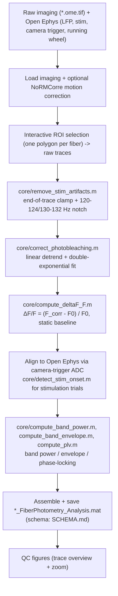

# Fiber Photometry Preprocessing Pipeline

## Overview

Takes raw GEVI fiber-photometry imaging (multi-part OME-TIFF stacks) and simultaneously
recorded Open Ephys LFP/stimulation/behaviour channels, and produces a single frozen-schema
`*_FiberPhotometry_Analysis.mat` datastruct: aligned, photobleaching-corrected, ΔF/F fiber
traces + LFP + running speed + stimulation timing. This is the shared input for every
downstream analysis in this repo (spectral, PAC, and all figure scripts). A detailed,
line-by-line walkthrough with a diagram is in
[`../../docs/WORKFLOW_SCHEMATICS.md`](../../docs/WORKFLOW_SCHEMATICS.md#1--fiber-photometry--open-ephys-preprocessing)
and [`../../docs/fiber_preprocessing_schematic.jpg`](../../docs/fiber_preprocessing_schematic.jpg).

## Directory Structure

```
fiber_photometry/
├── run_fiber_preprocessing_multitrial.m   # ★ Entry point: multiple trials per session
├── run_fiber_preprocessing_singletrial.m  # ★ Entry point: single trial / auto-finds first trial folder
├── artifact_removal_lfp.m                 # Standalone LFP artifact-mask tool (single session)
├── artifact_removal_lfp_multisession.m    # Same, batched across a whole animal cohort
├── config/
│   ├── fiber_preprocessing_multitrial_config.m   # Run parameters -- EDIT THIS, not the script
│   └── fiber_preprocessing_singletrial_config.m
├── core/                                  # Extracted, unit-tested computational functions
│   ├── README.md                          # Function-by-function index
│   ├── utils/                             # Generic signal/display helpers
│   └── tests/, utils/tests/               # Offline unit tests
├── tests/
│   ├── run_all_tests.m                    # One-shot offline test runner
│   ├── validate_refactor.m                # Level-1 offline validation
│   └── check_output_struct.m              # Level-2 post-run output validation
├── SCHEMA.md                              # Frozen output-struct contract
└── VALIDATION.md                          # How to validate changes (Level 1 + Level 2)
```

## Quick Start

1. Edit `config/fiber_preprocessing_multitrial_config.m` (or the `_singletrial_` variant):
   ```matlab
   MOUSE_NAME = 'Animal01';
   RECORDING_DATE = '01_01_25';
   RECORDING_ID = 'R1';
   BASE_PATH_ROOT = fullfile(lab_paths().data_root, 'FiberVoltageImaging');  % or hardcode your own
   ```
2. Run `run_fiber_preprocessing_multitrial.m` (or `_singletrial_`).
3. When prompted, draw one polygon ROI per fiber on the displayed frame (skipped if
   `PROCESS_FULL_FIELD = true`).
4. Output: `<mouse>_<date>-<id>_Trial<N>_FiberPhotometry_Analysis.mat`, plus a set of QC figures.

Use `run_fiber_preprocessing_singletrial.m` for a quick single recording (auto-detects the
first trial folder); use the `_multitrial_` variant when a session has several trial folders to
loop over.

## Pipeline stages



The 16 reusable computational steps (photobleaching correction, ΔF/F, stim-onset detection,
band power, PLV, artifact removal, colormaps, smoothing...) are unit-tested pure functions in
`core/` -- see `core/README.md` for the full function index. The interactive parts (ROI
drawing, plotting) remain in the two entry scripts since they need a live figure/user input.

## Standalone LFP artifact tools

`artifact_removal_lfp.m` (one session) and `artifact_removal_lfp_multisession.m` (a whole
cohort) let you visually inspect LFP traces, review an automatic artifact-detection pass
(MAD / rolling-variance / z-score based), and save a `*_artifact_removal.mat` mask file. These
masks are consumed by `../../spectral_analysis/` (artifact `'exclude'`/`'clean'` modes) and
optionally by `../../phase_amplitude_coupling/` (see its README).

## Validation

This pipeline can't be run end-to-end without real imaging + Open Ephys data and interactive
ROI selection, so changes are validated in two levels -- see **VALIDATION.md**:
- **Level 1** (offline, ~30s): `tests/run_all_tests.m` runs every unit test for `core/`.
- **Level 2** (real recording): process one recording before/after a change and diff the two
  output structs with `tests/compare_fiber_datastructs` (documented in VALIDATION.md), or check
  a single output's structural integrity with `tests/check_output_struct.m`.

## Output schema

The full frozen contract for `*_FiberPhotometry_Analysis.mat` (every top-level group, field,
shape, and which fields are conditional) is documented in **SCHEMA.md**.

## Required external dependencies

Not bundled with this repo -- install separately and point `config/lab_paths.m`'s
`p.toolboxes` at your local copies (see `../../config/README.md` and
`../../environment/SETUP.md`):
- `load_open_ephys_data.m` -- Open Ephys data loading
- NoRMCorre -- optional motion correction
- FieldTrip -- used downstream for coherence, not by this pipeline directly
