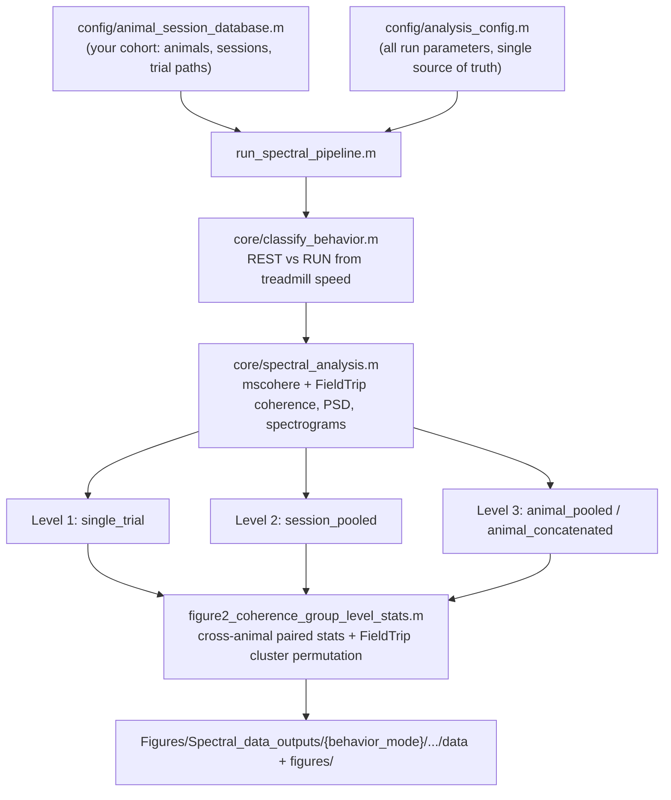

# Spectral Analysis Pipeline (Coherence & PSD)

## Overview

This folder computes LFP-GEVI coherence and power spectral density (PSD) analysis across
three pooling levels, plus cross-animal group statistics. It produces the locomotion-dependent
spectral/coherence results behind **Figure 2** (and the underlying spectral machinery reused by
Figure 6), and the DBS spectral analysis behind **Figure 4** / Suppl. Figure 2 (via
`run_stim_spectral_pipeline.m`).

**ONE SCRIPT TO RUN EVERYTHING (baseline):** `run_spectral_pipeline.m`
**ONE SCRIPT TO RUN EVERYTHING (stimulation/DBS):** `run_stim_spectral_pipeline.m`

## Directory Structure

```
spectral_analysis/
├── run_spectral_pipeline.m                # ★ MAIN ENTRY POINT (baseline/locomotion)
├── run_stim_spectral_pipeline.m           # ★ MAIN ENTRY POINT (DBS/stimulation)
├── figure2_coherence_group_level_stats.m  # Group-level statistics (called by run_spectral_pipeline.m)
├── check_artifact_cleaning.m              # Diagnostic: visualize LFP artifact masks
├── check_speed_diagnostics.m              # Diagnostic: debug REST/RUN classification
├── config/
│   ├── analysis_config.m                  # Master configuration (baseline pipeline)
│   ├── stim_analysis_config.m             # Master configuration (DBS pipeline)
│   └── animal_session_database.m          # Animal/session definitions -- EDIT with your cohort
└── core/
    ├── spectral_analysis.m                # Unified coherence/PSD/spectrogram computation
    ├── stim_spectral_analysis.m           # DBS-epoch spectral computation
    └── classify_behavior.m                # REST/RUN classification
```

## Pipeline flow



For DBS/stimulation sessions, `run_stim_spectral_pipeline.m` follows the same shape but reads
`config/stim_analysis_config.m` and calls `core/stim_spectral_analysis.m`, which segments each
trial into pre-stim / transient / sustained / post-stim epochs instead of REST/RUN.

## Quick Start

### Run the Complete Pipeline

1. Edit `config/animal_session_database.m` — replace the example animals with your own cohort
   (see the file's own header for the exact struct schema).
2. Edit `config/analysis_config.m` — the **single source of truth** for all run settings. The
   most-edited knobs are grouped at the top:

```matlab
% Which analysis levels to run?
cfg.run_single_trial     = false;
cfg.run_session_pooled   = false;
cfg.run_animal_pooled    = false;
cfg.run_group_statistics = true;

% Which methods to use?
cfg.methods = {'mscohere', 'fieldtrip'};

% Which animals to process ({} = all in animal_session_database.m)
cfg.animals_to_process = {};

% REST/RUN classification mode + thresholds
cfg.behavior.classification_mode = 'clear';   % or 'standard'
cfg.behavior.run_threshold  = 2.0;            % Speed > this = RUN (cm/s)
cfg.behavior.rest_threshold = 0.1;            % Speed < this = REST ('clear' mode)

% Artifact handling
cfg.artifact.mode = 'clean';   % 'none' | 'exclude' | 'clean'
```

3. Run `run_spectral_pipeline.m` — **that's it!**

   For a one-off change without editing the config, use the *OPTIONAL PER-RUN
   OVERRIDES* block near the top of `run_spectral_pipeline.m`
   (e.g. `cfg.methods = {'mscohere'};`).

### Run the DBS/Stimulation Pipeline

1. Edit `config/stim_analysis_config.m` — replace the example `cfg.stim_database` entries with
   your own DBS sessions (stimulation frequency, voltage, amp-/energy-balanced condition, trial
   folder naming). Two timing presets are provided as examples: a default for short (~1s)
   stimulation and a commented-out alternative for longer (~10s) stimulation — pick whichever
   matches your protocol.
2. Edit `ANIMALS_TO_PROCESS` / `SESSIONS_TO_PROCESS` at the top of
   `run_stim_spectral_pipeline.m`.
3. Run `run_stim_spectral_pipeline.m`.

## Analysis Levels

### Level 1: Single Trial
- **Figures**: Heatmaps (speed, spectrogram, coherence) + Coherence spectrum + PSD spectrum
- **Purpose**: Visualize individual recording trials

### Level 2: Session-Pooled
- **Figures**: Coherence spectrum + PSD spectrum (no heatmaps)
- **Purpose**: Average across trials within a recording session
- **Method**: Compute spectra per trial, then average

### Level 3: Animal-Pooled
- **Figures**: Coherence spectrum + PSD spectrum (no heatmaps)
- **Purpose**: Average across all sessions for one animal
- **Method**: Compute spectra per session, then average (NOT raw signal concatenation!)

### Group Statistics
- **Purpose**: Compare across animals
- **Tests**: Paired t-tests with FDR correction, cluster-based permutation (FieldTrip)
- **Script**: `figure2_coherence_group_level_stats.m` (invoked automatically by
  `run_spectral_pipeline.m` when `cfg.run_group_statistics = true`)

## Coherence Methods

### mscohere (MATLAB)
- Uses MATLAB's built-in `mscohere()` and `cpsd()` functions
- Welch's method with Hanning window
- Fast, simple, reliable

### FieldTrip
- Multi-taper spectral estimation
- Better frequency smoothing control
- Supports cluster-based permutation testing
- More flexible for neurophysiology data
- **External dependency, not bundled** -- see `../environment/SETUP.md`

## REST/RUN Classification Modes

### Standard Mode
```
RUN:  speed > 3 cm/s
REST: speed ≤ 3 cm/s
```
- Short bouts merged into surrounding state
- REST + RUN = 100% of data

### Clear Mode (Strict)
```
RUN:      speed > 3 cm/s
REST:     speed < 0.1 cm/s
EXCLUDED: 0.1 ≤ speed ≤ 3 cm/s
```
- Cleaner separation between states
- Intermediate speeds excluded from analysis
- REST + RUN < 100% (ambiguous periods excluded)

Set via `cfg.behavior.classification_mode` in `config/analysis_config.m`.

## Configuration

### Master Config: `config/analysis_config.m`

All parameters are centralized here:
- Spectrogram parameters (window, overlap, frequency range)
- Coherence parameters (segment length, overlap, tapers)
- PSD parameters
- Behavior classification thresholds
- Frequency bands for statistics
- Figure appearance settings
- Path configuration (via `../config/lab_paths.m`)

### Animal Database: `config/animal_session_database.m`

Defines all animals, sessions, and trial paths. Replace the two example animals with your own
cohort -- see the in-file docstring for the exact schema (including how to pool a session that
was split across two recording runs).

## Output Structure

All outputs are organized by **behavior classification mode** first:

```
Figures/Spectral_data_outputs/
│
├── standard/                              # ← Behavior mode
│   │
│   ├── single_trial/                      # ← Level 1
│   │   └── {MouseID}/
│   │       └── {SessionID}/
│   │           ├── data/                  # MATLAB .mat files
│   │           │   └── {method}.mat
│   │           └── figures/               # Python figures
│   │               ├── {method}_heatmaps.png
│   │               ├── {method}_coherence.png
│   │               └── {method}_psd.png
│   │
│   ├── session_pooled/                    # ← Level 2
│   │   └── {MouseID}/
│   │       └── {SessionID}/
│   │           ├── data/
│   │           │   └── {method}.mat
│   │           └── figures/
│   │
│   ├── animal_pooled/                     # ← Level 3
│   │   └── {MouseID}/
│   │       ├── data/
│   │       │   └── {method}.mat
│   │       └── figures/
│   │
│   └── group_level/                       # ← Group statistics
│       ├── data/
│       │   ├── mscohere_session_pooled.mat
│       │   ├── mscohere_animal_pooled.mat
│       │   ├── fieldtrip_*.mat
│       │   └── fieldtrip_cluster_*.mat
│       └── figures/
│           └── *.png
│
└── clear/                                 # ← Same structure for 'clear' mode
    └── ...
```

## Data Struct Fields

All analysis scripts save data structs with these fields:

### Coherence
```matlab
fig2_out.coh_overall    % Overall coherence spectrum
fig2_out.coh_rest       % REST coherence spectrum
fig2_out.coh_run        % RUN coherence spectrum
fig2_out.freq           % Frequency axis (Hz)
fig2_out.pct_rest       % Percentage of time in REST
fig2_out.pct_run        % Percentage of time in RUN
```

### PSD
```matlab
fig3_out.psd_lfp_overall    % Overall LFP PSD
fig3_out.psd_gevi_overall   % Overall GEVI PSD
fig3_out.psd_lfp_rest       % REST LFP PSD
fig3_out.psd_gevi_rest      % REST GEVI PSD
fig3_out.psd_lfp_run        % RUN LFP PSD
fig3_out.psd_gevi_run       % RUN GEVI PSD
fig3_out.freq_psd           % Frequency axis (Hz)
```

## Troubleshooting

### "FieldTrip not found"
Add FieldTrip to your MATLAB path (see `../config/lab_paths.m` -> `p.toolboxes`) or install from:
https://www.fieldtriptoolbox.org/download/

### "Insufficient data" warnings
- Check that trial files exist at specified paths
- Ensure behavioral classification yields enough REST/RUN samples

### Low statistical significance
- Try `cfg.behavior.classification_mode = 'clear'` for cleaner separation
- Consider band-averaged statistics (more power)
- Check effect sizes (Cohen's d) - small effects need larger N
